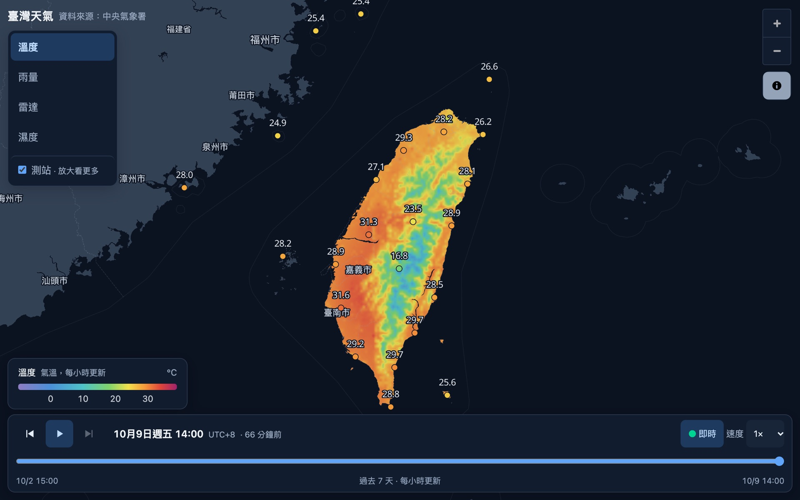
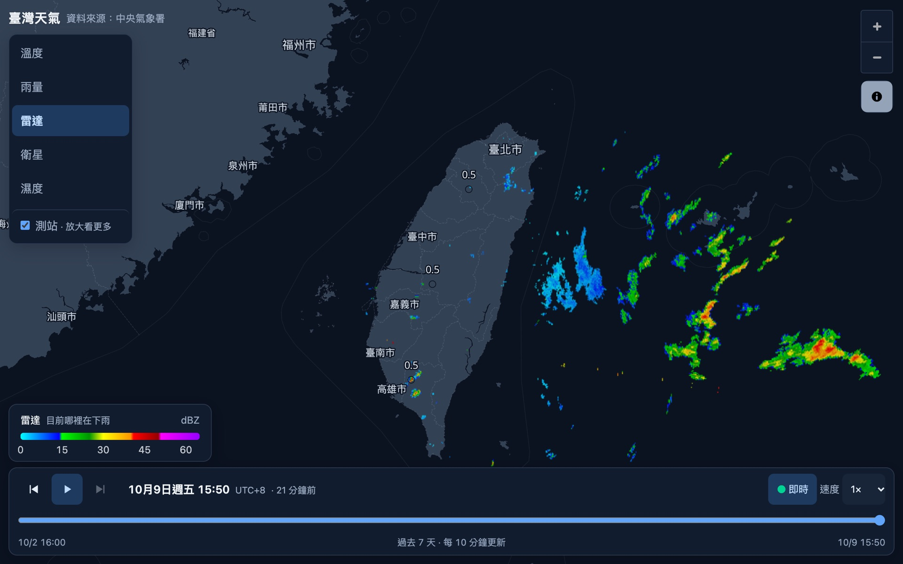
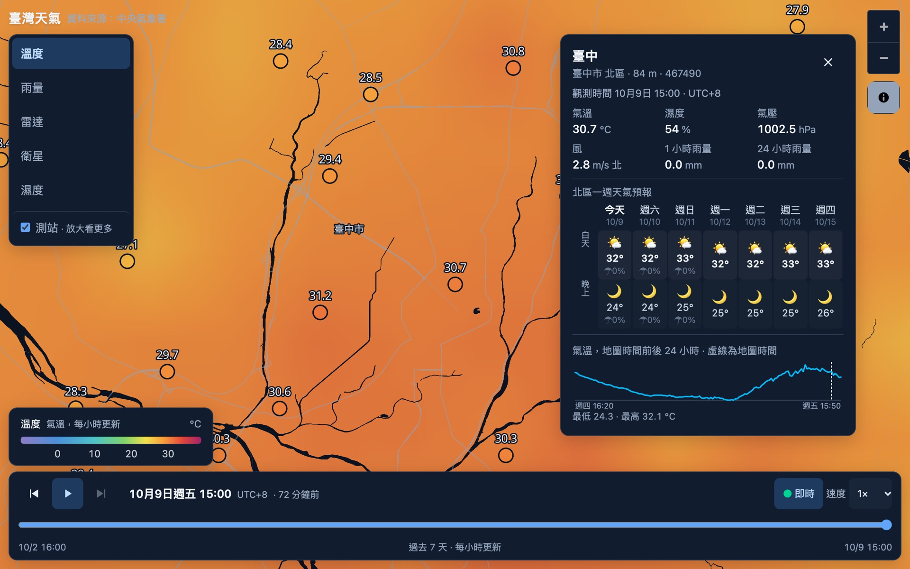
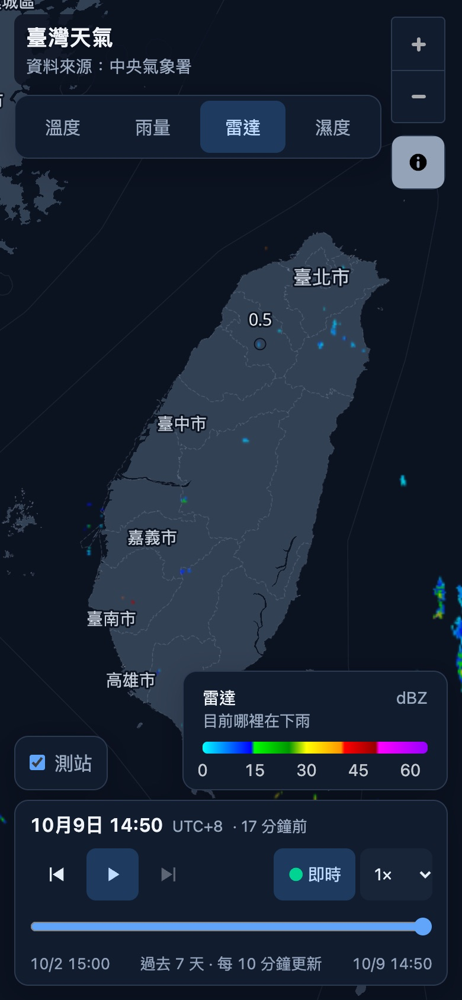
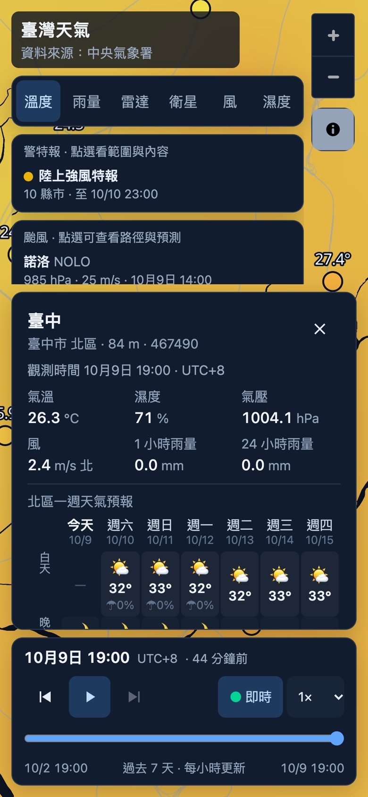

# 臺灣天氣（Weather Taiwan）

以中央氣象署（CWA）開放資料製作的 Windy 風格臺灣天氣地圖：在地圖上看溫度、雨量、雷達回波與濕度，並可回放過去 24 小時。

- 線上版：<https://a-io-t-dic-l3.vercel.app>
- 設計文件：[DESIGN.md](DESIGN.md)（英文）



| 雷達回波 | 測站與資訊卡 |
|---|---|
|  |  |

<p>
  
  &nbsp;
  
</p>

## 功能現況

| 圖層 | 內容 | 資料來源 | 更新頻率 |
|---|---|---|---|
| 溫度 | 全臺氣溫格點（僅陸地） | CWA `O-A0038-003` | 每小時 |
| 雨量 | 過去 1 小時累積雨量（雷達估計） | CWA `O-B0045-001` | 每 10 分鐘 |
| 雷達 | 雷達合成回波圖 | CWA `O-A0058-005` | 每 10 分鐘 |
| 濕度 | 相對濕度，由測站觀測值在瀏覽器內插而成 | 測站觀測 | 每 10 分鐘 |

- **測站**：全臺一千三百多個氣象站與雨量站的即時觀測（CWA `O-A0001-001`、`O-A0002-001`、`O-A0003-001`），點選可看該站讀數與過去 24 小時趨勢圖。
- **鄉鎮預報**：測站資訊卡列出所在鄉鎮接下來的天氣、溫度與降雨機率（CWA `F-D0047-003`～`-087` 各縣市鄉鎮一週預報）。
- **時間軸**：每個圖層都能回放過去 24 小時。
- **語言**：介面只有繁體中文。

尚未完成：風場與其他圖層（衛星雲圖等），規劃見 DESIGN.md 第 23 節的 Milestone 6、7。

## 操作說明

**圖層與圖例**　一次顯示一個圖層。圖例除了色階與單位，也用一句話說明目前圖層是什麼（例如雷達：「目前哪裡在下雨」）。

**時間軸**

- 開啟時自動跟著最新資料，並顯示這筆資料是多久以前的（例如「22 分鐘前」）。時間一律是臺灣時間（UTC+8）。
- **即時** 亮起表示正在跟隨最新資料。拖動滑桿可停在過去某個時間；按 **回到最新**，或把滑桿拖回最右邊，就會恢復跟隨。
- 在最新時間按 **播放**，會重播最近 3 小時（每小時更新的溫度圖層則重播整天）；在其他時間按播放，則從該處往後播。
- 鍵盤：空白鍵播放／暫停，← → 前後移動一個時間。用 Tab 鍵移到地圖上時，方向鍵仍用來平移地圖。

**測站**　預設開啟（取消勾選 **測站** 可隱藏）。縮小地圖時只顯示主要測站，彼此保持間距：氣溫與濕度優先顯示氣象署的局屬測站（臺北、臺中、高雄等），其次是自動站，同級時以海拔較低者優先；雨量則以雨下得最大的測站優先，且只顯示 1 小時雨量達 0.5 mm 的測站。每放大一級就多顯示一些，縮放層級 11 以上顯示全部測站。點選測站會開啟資訊卡，讀數跟著時間軸的時間走，趨勢圖上的虛線標示目前的地圖時間。資訊卡也列出測站所在鄉鎮接下來三個時段（12 小時一段）的天氣、溫度範圍與降雨機率，資料來自氣象署鄉鎮預報；這是整個鄉鎮的預報，海拔 1000 m 以上的測站會另外註明實際氣溫通常較低。

**狀態與重試**　資料載入中或無法取得時，時間軸面板內會顯示一行說明；可以重試的情況會附上 **重試** 按鈕。

**版面**　視窗寬、高都至少 640 px 時，圖層列表在左側。較小的畫面（手機直放或橫放）改為一排圖層按鈕，**測站** 開關移到圖例旁；開啟測站資訊卡時，圖例那一排會讓出空間。時間軸永遠留在畫面內，空間不夠時縮小並捲動的是圖層列表與測站資訊卡。

## 技術架構

| 部分 | 使用技術 |
|---|---|
| 前端（`apps/web`） | React 19、Vite 8、Tailwind CSS 4、MapLibre GL 6；底圖為 OpenFreeMap |
| 後端（`apps/api`） | Hono，部署為 Vercel Functions（東京 `hnd1`） |
| 資料庫 | Supabase Postgres，以 Drizzle ORM 定義 schema |
| 檔案 | Supabase Storage：格點與雷達影格（PNG） |
| 排程 | Supabase Cron（`pg_cron` + `pg_net`），密鑰存放在 Supabase Vault |

```text
apps/web/src        前端：地圖（map/）、時間軸（timeline/）、元件（components/）、中英文字典（i18n.ts）
apps/api/src        後端：CWA 介接（cwa/）、資料擷取（ingestion/）、API 路由（routes/）、資料庫（db/）
apps/api/scripts    維運指令：migration、排程狀態、補資料、清理規則驗證
supabase/migrations 資料庫 migration（含手寫的排程與清理工作）
api/index.ts        Vercel 的 API 進入點
docs/screenshots    本文件使用的畫面截圖
```

## 開發

需要 Node 22、pnpm 10，以及 [Task](https://taskfile.dev)。

```bash
nvm use                   # 切換到 Node 22（每個新開的終端機都要執行）
pnpm install
cp -n .env.example .env   # 第一次設定時建立 .env（已存在就不會覆蓋），各項說明見 DESIGN.md 第 17 節
task dev                  # 前端 http://localhost:5273、後端 :8787（前端以 /api 代理）
```

Node 版本不是 22 或沒有 `.env` 時，需要它們的 `task` 指令會直接說明原因並停止。

> 本專案只有一個 Supabase 資料庫：本機後端連的就是正式站使用的那一個。讀取資料沒有影響，會寫入的指令已在下表標明。

`task` 會列出所有指令：

| 指令 | 用途 |
|---|---|
| `task dev` | 同時啟動前端與後端（熱重載） |
| `task web`／`task api` | 只啟動前端／只啟動後端 |
| `task stop` | 停止本專案啟動的開發伺服器（不會動到其他專案） |
| `task check` | CI 執行的全部檢查：型別檢查、測試、建置 |
| `task health` | 檢查本機後端與資料庫連線（後端需先啟動） |
| `task ingest` | 在本機後端觸發一次測站資料擷取（後端需先啟動；會寫入資料庫，內容與排程工作相同） |

資料庫與排程相關的指令見下方各節。沒有安裝 Task 時，也可以直接使用 `pnpm dev`、`pnpm typecheck`、`pnpm test`、`pnpm build`。

### 環境變數

設定在專案根目錄的 `.env`（不進版控），部署時設定在 Vercel。

| 變數 | 用途 |
|---|---|
| `CWA_API_KEY` | 氣象署開放資料授權碼。只在後端使用，不可加上 `VITE_` 前綴 |
| `SUPABASE_URL`、`SUPABASE_SERVICE_ROLE_KEY` | Supabase 專案網址與 service role 金鑰（後端寫入 Storage 用） |
| `DATABASE_URL` | Postgres 連線字串（transaction pooler，埠號 6543）；migration 會自動改用 session pooler（5432） |
| `SUPABASE_STORAGE_BUCKET` | 存放影格的 Storage bucket 名稱 |
| `INGESTION_SECRET` | 內部排程 API 的密鑰，以 `openssl rand -hex 32` 產生 |
| `API_BASE_URL` | 排程工作呼叫的正式站網址（必須是 `https://`）；由 `task cron:secrets` 寫入 Vault |

## 資料庫

Schema 定義在 `apps/api/src/db/schema.ts`。請勿直接手動修改正式資料庫。

```bash
task db:generate -- --name add_x   # schema → supabase/migrations/*.sql，檢查後 commit（schema 沒變時不會產生檔案）
task db:plan                       # 預覽會套用哪些 migration（不會變更資料庫）
task db:push                       # 套用到 Supabase（會變更正式資料庫，執行前會再確認一次）
```

排程、資料清理、RLS 等 migration 是手寫的 SQL，放在同一個資料夾，依檔名順序套用。

## API

公開 API 皆為唯讀；資料路由由 CDN 快取（測站清單 1 小時，其餘 60 秒）。時間格式為帶時區的 ISO-8601，例如 `2026-09-21T20:00:00+08:00` 或 `...Z`。

| 路由 | 回傳內容 |
|---|---|
| `GET /api/health` | 服務與資料庫連線狀態 |
| `GET /api/stations` | 所有測站（編號、氣象署站號、名稱、縣市、WGS84 座標、海拔） |
| `GET /api/stations/:cwaId` | 單一測站與其最新讀數 |
| `GET /api/stations/:cwaId/history?from=&to=` | 該站在指定區間的觀測（預設最近 24 小時，最長 62 天） |
| `GET /api/observations?at=` | 指定時間點各測站的最新讀數（預設為現在），對應時間軸上的一個位置 |
| `GET /api/forecast?county=&town=` | 鄉鎮未來一週逐 12 小時預報（天氣、最高／最低溫、降雨機率），即時向氣象署查詢、不存入資料庫，CDN 快取 30 分鐘 |
| `GET /api/frames?layer=&from=&to=` | 圖層的時間軸影格。`layer` 可為 `stations`、`radar`、`rain-grid`、`temperature-grid`；`satellite`、`wind` 已保留，目前沒有資料 |

參數格式不正確時回傳 400 與錯誤說明。

內部路由供排程使用，需帶 `Authorization: Bearer $INGESTION_SECRET`：

| 路由 | 用途 |
|---|---|
| `POST /api/internal/ingest/stations` | 擷取測站觀測 |
| `POST /api/internal/ingest/grids` | 擷取溫度、雨量格點與雷達圖；加上 `?layer=` 可只抓其中一項 |
| `POST /api/internal/backfill/stations?before=&limit=` | 從氣象署歷史 API 補回測站的每小時觀測 |
| `POST /api/internal/prune/frames` | 刪除過期影格 |

## 排程工作（Supabase Cron）

| 工作 | 時間（臺灣時間） | 內容 |
|---|---|---|
| `ingest-stations` | 每 10 分鐘（第 5、15、25… 分） | 測站觀測寫入資料庫 |
| `ingest-grids` | 每 10 分鐘（第 8、18、28… 分） | 溫度、雨量格點與雷達圖存成影格（Storage） |
| `ingest-radar` | 每 10 分鐘（第 3、13、23… 分） | 只抓雷達圖 |
| `prune` | 每日 03:30 | 清理過期觀測，並記錄資料庫大小 |
| `prune-frames` | 每日 03:40 | 刪除過期影格 |

為什麼雷達要多抓一次：氣象署只提供最新的一張雷達圖，而且約在資料時間後 8 到 10 分鐘才發布，`ingest-grids` 常常剛好在新圖出現前抓取，下一次再抓時該圖已被更新的一張取代。兩次 `ingest-grids` 之間補抓一次，就不會漏掉。

**資料保存期限**　測站觀測：10 分鐘資料保留 3 天，每小時資料保留 60 天。影格：14 天。這些期限是配合 Supabase 免費方案的容量（資料庫 500 MB、Storage 1 GB）。

維運指令：

| 指令 | 用途 |
|---|---|
| `task cron:status` | 查看排程工作、最近的執行結果與 HTTP 回應、資料量與每日資料庫大小紀錄（唯讀） |
| `task cron:secrets` | 把 `.env` 的 `API_BASE_URL` 與 `INGESTION_SECRET` 寫入 Supabase Vault；更換密鑰或正式站網址後執行 |
| `task backfill:stations` | 補回最近 24 小時的測站每小時觀測（在正式站執行，可重複執行，不會產生重複資料） |
| `task prune:check` | 驗證清理規則（在交易中執行，結束後一律還原，不會留下任何變更） |

## 測試與 CI

測試使用 Node 內建的測試執行器（`node:test`），測試檔與原始碼放在一起（`*.test.ts`）。

```bash
task check   # 等同 CI：pnpm typecheck、pnpm test、pnpm build
```

GitHub Actions 在每次 push 與 pull request 執行同一組檢查。

## 部署

推送到 `main` 就會部署到 Vercel。整個 repo 是一個 Vercel 專案：靜態網站來自 `apps/web/dist`，API 來自 `api/index.ts`。

Vercel 建置時會先執行型別檢查與測試（`pnpm typecheck && pnpm test && pnpm build`），測試失敗就不會部署。新的 migration 不會隨部署自動套用，需另外執行 `task db:push`。

## 資料來源

- 天氣資料：[中央氣象署開放資料平臺](https://opendata.cwa.gov.tw/)
- 底圖：[OpenFreeMap](https://openfreemap.org/)、© OpenMapTiles，資料來自 OpenStreetMap
